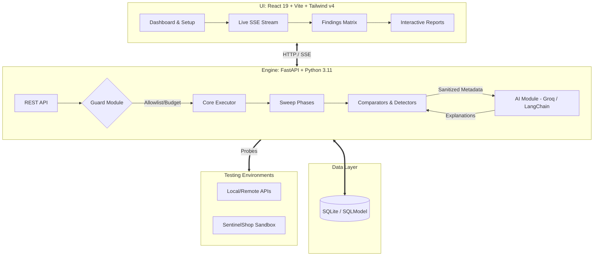
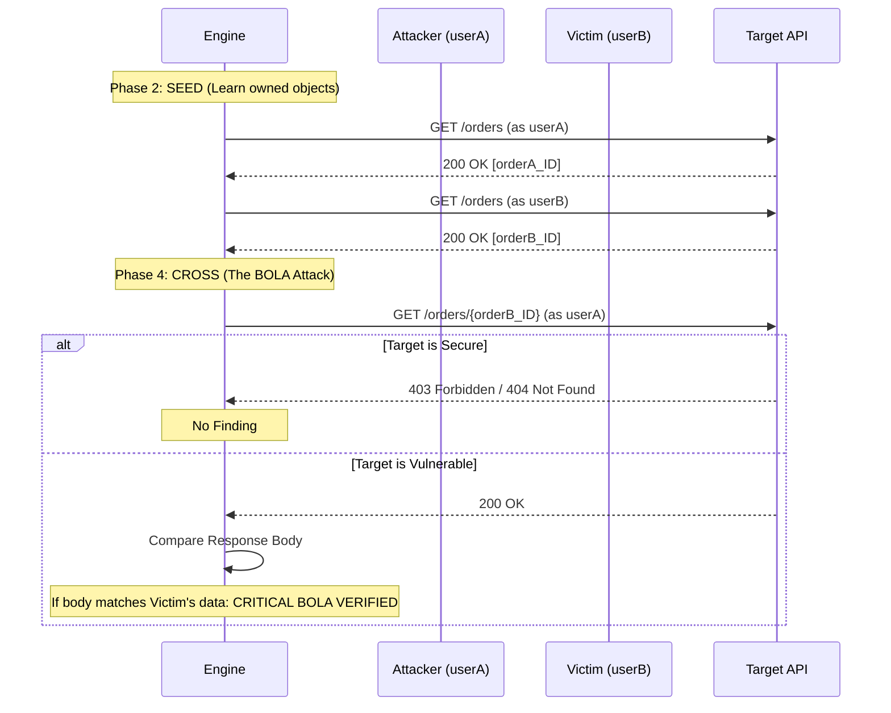

<div align="center">
  
  <h1>SentinelAPI</h1>
  <h3>Zero-Trust API Vulnerability Scanner & Exploit Prover</h3>
  <p><em>The AI suggests. The scanner executes. The HTTP evidence verifies.</em></p>

  <p>
    <a href="#features"></a>
    <a href="#stack"></a>
    <a href="#stack"></a>
    <a href="#stack"></a>
    <a href="#stack"></a>
  </p>
</div>

---

## 📖 Table of Contents

- [The Problem & Our Solution](#-the-problem--our-solution)
- [Zero-Trust Axioms](#-five-zero-trust-axioms)
- [Advanced System Architecture](#-advanced-system-architecture)
- [Detection Capabilities (OWASP Mapped)](#-what-it-detects-one-sweep-six-classes)
- [The Access Matrix & BOLA Pipeline](#-the-access-matrix--bola-detection-pipeline)
- [Technology Stack](#-technology-stack)
- [Folder Structure](#-folder-structure)
- [Getting Started (Installation & Setup)](#-getting-started)
- [Core Workflows & Features](#-core-workflows--features)
- [Security & Threat Model](#-security--threat-model)
- [Future Roadmap](#-future-roadmap)

---

## 🚨 The Problem & Our Solution

**The Problem:** Existing API security tools fall into two flawed extremes:
1. **Fuzzers & DASTs** blindly spray payloads hoping for a 500 crash or SQL syntax error. They cannot understand complex business logic or authorization boundaries.
2. **AI Static Analyzers** read code or specs and guess what *looks* vulnerable, generating massive amounts of false positives with no proof.

**Our Solution:** **SentinelAPI proves it.** 
SentinelAPI takes an OpenAPI spec and multiple user identities (e.g., Alice, Bob, Admin, Anonymous). It systematically tests *every* endpoint against *every* identity to build an **Access Matrix**. It doesn't rely on HTTP status codes; it extracts ownership from response bodies. It proves vulnerabilities (like BOLA/IDOR) by providing the exact request/response evidence and a reproducible cURL PoC. 

---

## 🛡️ Five Zero-Trust Axioms

1. **Never trust the spec** — the OpenAPI doc is just a claim; spec drift is a finding.
2. **Never trust the status code** — a `200 OK` is not authorization; ownership is proven from the JSON body.
3. **Never trust the identity** — every endpoint is probed with every provided identity.
4. **Never trust the model** — AI can only *propose* or *explain*; only the deterministic Python engine creates a finding.
5. **Never trust the operator** — allowlists, budgets, circuit breakers, and redaction live securely in the backend engine.

---

## 🏗️ Advanced System Architecture

SentinelAPI follows a modern, decoupled architecture with a strict boundary between the deterministic execution engine and the LLM helper.



---

## 🎯 What it Detects (One Sweep, Six Classes)

| Vulnerability Class | OWASP 2023 | Detection Mechanism |
| :--- | :--- | :--- |
| **BOLA (Hero)** | **API1** | 6-probe control set; ownership read from response body; victim vs attacker cross-check. |
| **Broken Authentication** | **API2** | Spec says secured, but anon receives `2xx` with data. Malformed-token controls. |
| **Excessive Data Exposure**| **API3** | Undocumented fields + sensitive name/value pattern matching (e.g., bcrypt hashes, SSNs). |
| **Missing Rate Limiting** | **API4** | Bounded burst of failed logins to auth endpoints; checks for `429` / RateLimit headers. |
| **BFLA** | **API5** | Low-privilege user gets `2xx` on admin-scoped endpoint; anon denied. |
| **Misconfiguration** | **API8** | Missing security headers, reflected CORS with credentials, exposed debug endpoints, version leaks. |

> **Note:** Every finding carries redacted request/response evidence, a severity breakdown, and two-state confidence (`VERIFIED` / `POTENTIAL`).

---

## 🔍 The Access Matrix & BOLA Detection Pipeline

Authorization is treated as a property of the `(identity, endpoint, object)` triple. 



---

## 🛠️ Technology Stack

### Frontend (Client)
- **Framework:** React 19, TypeScript, Vite
- **Styling & UI:** Tailwind CSS v4, Lucide Icons, Framer Motion (micro-animations)
- **State & Data:** React Router, Server-Sent Events (SSE) for live logs

### Backend (Engine)
- **Core API:** Python 3.11, FastAPI, Uvicorn
- **HTTP Client:** `httpx` (async, strictly timeout-bound)
- **Database:** SQLite with SQLModel (Pydantic-based ORM)
- **Parsing:** `prance`, `openapi-spec-validator` (JSON/YAML, `$ref` resolution)
- **AI Integration:** LangChain, Groq API (Strictly separated provider interface)

### Tooling & Security
- **Containerization:** Docker & Docker Compose
- **Security:** `cryptography` (Fernet) for credential encryption at rest
- **CLI:** Typer CLI & Rich for terminal outputs and CI/CD gates

---

## 📂 Folder Structure

```text
d:\Amity-Hackathon\sentinelapi
├── docker-compose.yml       # Orchestrates Engine + SentinelShop
├── Dockerfile               # Backend Engine Container
├── Dockerfile.sentinelshop  # Vulnerable Target Container
├── render.yaml              # Production deployment config
├── cli/                     # Typer CLI for CI/CD scans
├── docs/                    # Architecture and Threat Models
├── engine/                  # FastAPI Core Backend
│   ├── ai/                  # LLM integration (strictly sandboxed)
│   ├── api/                 # REST Endpoints (scans, targets, identities)
│   ├── core/                # Executor, Guard, Sweep, Comparator, Risk Engine
│   ├── detectors/           # BOLA, BFLA, Auth, RateLimit modules
│   └── models/              # SQLModel Tables & Pydantic Schemas
├── sentinelshop/            # Vulnerable Sandbox Target (FastAPI)
│   ├── openapi.yaml         # The expected spec
│   └── app.py               # The flawed implementation
└── web/                     # React 19 Frontend
    ├── src/                 # Pages, Components, Hooks (SSE)
    └── vercel.json          # Vercel routing / rewrites
```

---

## 🚀 Getting Started

### Prerequisites
- Python 3.11+
- Node.js 20+
- Docker & Docker Compose (Optional but recommended)

### Option 1: Docker Compose (Easiest)
Spin up the engine and the bundled vulnerable target (`SentinelShop`) instantly.
```bash
cd sentinelapi
docker compose up --build -d
```
- **Engine:** `http://localhost:8000`
- **Target:** `http://localhost:4000`

### Option 2: Local Development (Manual)

**1. Start the Vulnerable Target (Terminal 1)**
```bash
cd sentinelapi
python -m venv venv
source venv/bin/activate  # On Windows: .\venv\Scripts\activate
pip install -r requirements.txt
uvicorn sentinelshop.app:app --port 4000 --reload
```

**2. Start the Engine (Terminal 2)**
```bash
cd sentinelapi
cp .env.example .env  # Add your GROQ_API_KEY here for AI explanations
uvicorn engine.main:app --port 8000 --reload
```

**3. Start the Frontend (Terminal 3)**
```bash
cd sentinelapi/web
npm install
npm run dev
```
Visit `http://localhost:5174` in your browser.

---

## 🔒 Security & Threat Model

SentinelAPI tests security, which means it must be secure itself.
- **Circuit Breaker:** If target latency triples vs baseline, or >30% requests fail, the scan aborts immediately to prevent DDoS.
- **Allowlist & SSRF Protection:** The engine refuses to scan public IPs unless `SENTINEL_ALLOW_PUBLIC=1` is explicitly set. No redirects are followed.
- **Credential Encryption:** All API keys and passwords entered into the UI are encrypted at rest using AES (Fernet). 
- **Data Privacy:** Request bodies, passwords, and PII are redacted locally in Python before any metadata is sent to the LLM for summarization. The AI **never** sees your raw data.

---

## 🔄 Core Workflows & Features

1. **Target Setup:** Point the scanner at a Base URL (e.g., `http://localhost:4000`).
2. **Spec Ingestion:** Upload an OpenAPI v3 spec (`.yaml` or `.json`). The engine parses it, counting total endpoints, object-bearing routes, and admin scopes.
3. **Identity Verification:** Support for **Bearer Tokens, Password Login (Automated POST), and API Keys**. Enter credentials for Alice, Bob, and Admin. The engine validates them before scanning.
4. **Live Scan Streaming:** Watch the engine perform the 8-phase sweep in real-time via Server-Sent Events (SSE). View the exact latency, endpoints tested, and findings instantly.
5. **Report Generation:** Download comprehensive JSON or SARIF reports for CI/CD integrations.

---

## 🗺️ Future Roadmap

- [ ] **GraphQL Support:** Expand beyond REST to test GraphQL introspection and field-level authorization.
- [ ] **OAuth2 Flows:** Native support for automated OAuth2 Authorization Code and Client Credentials flows.
- [ ] **Custom AI Providers:** Support for local Ollama instances to ensure zero data leaves the corporate network.

---

<div align="center">
  <b>Built for AmiHacks 1.0 · Track C · Problem Statement 3</b>
</div>
